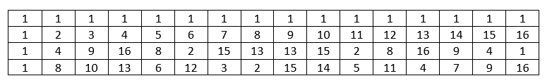
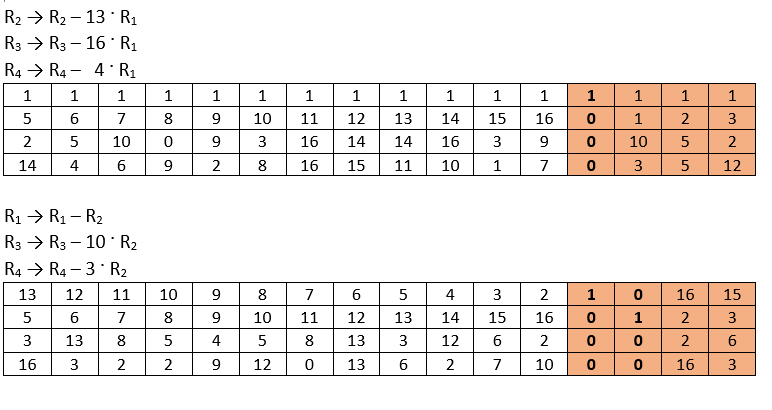
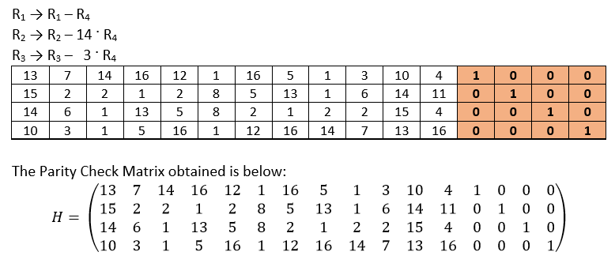
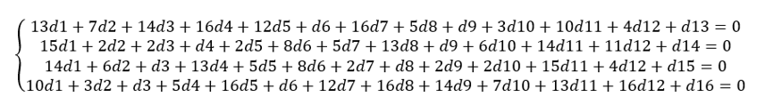
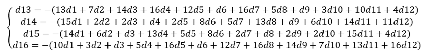
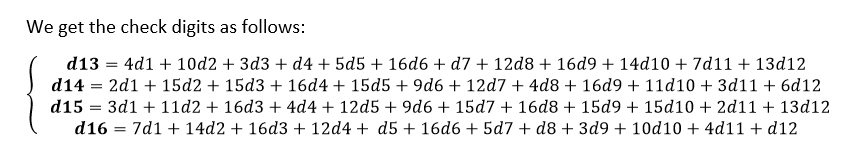
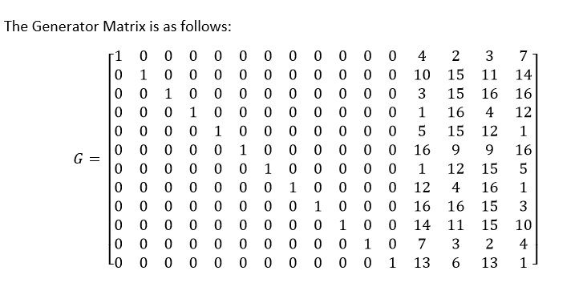

# BCH (16,12) Error Correction Code

## Overview

This project implements BCH (16,12) error correction encoding and decoding using Python and Tkinter. The BCH(16,12) code is designed to detect and correct errors in 16-digit encoded sequences, which are derived from 12-digit input data.

## Mathematical Background

### Vandermonde Matrix and Operations

The Vandermonde Matrix is essential in constructing the generator matrix for BCH(16,12) codes. Below is an example of the Vandermonde matrix used in this implementation:



The operations performed on this matrix to generate the **Parity Check Matrix** involve several steps of matrix transformations, which are necessary for detecting and correcting errors in the encoded sequences.

#### Operations

1. **Step 1**: Apply the first transformation to the Vandermonde matrix.  
   

2. **Step 2**: Perform the second transformation to create the Parity Check Matrix.  
   

The resulting **Parity Check Matrix** is used in the error detection and correction process.

### Syndrome Computation

The syndrome computation helps in determining the presence and location of errors by applying modular arithmetic to the Parity Check Matrix.

### Check Digits Calculation

We obtain the check digits by following the steps below:

1. **Step 1**: Start with the 12-digit input sequence.

2. **Step 2**: Use the generator matrix (derived from the Vandermonde matrix) to compute the check digits.

3. **Step 3**: Append the check digits to the original 12-digit input sequence to form a complete 16-digit encoded sequence.


The check digits ensure that the encoded sequence can be validated and any errors can be detected and corrected.

### Deriving the Generator Matrix

Based on the calculations of the check digits, we can derive the **Generator Matrix**. The generator matrix is obtained by:

1. **Step 1**: Using the check digits and the original input sequence, apply modular arithmetic to generate the matrix.
2. **Step 2**: The resulting matrix represents the transformation needed to encode the 12-digit input sequence into a 16-digit encoded sequence.



The **Generator Matrix** plays a crucial role in the encoding process as it is used to generate the check digits and, ultimately, to encode the data. It will be used during the encoding process to ensure the integrity of the encoded sequence and to correct errors during the decoding phase.

## Features

- **BCH Generator**: Computes check digits for a given 12-digit input.
- **Error Detection & Correction**: Uses syndrome calculations to detect and correct up to two errors in the encoded sequence.
- **Hexadecimal Support**: Accepts hexadecimal inputs (e.g., A, B, C for values 10, 11, 12) and outputs check digits in hexadecimal format (e.g., D, E, F).
- **JSON Import/Export**: Supports batch processing by importing and exporting multiple input sequences using JSON format.
- **Graphical User Interface (GUI)**: Built with Tkinter to provide an easy-to-use interface for users.

## Implementation Details

The implementation follows these key mathematical concepts:

- **Vandermonde Matrix**: Used in constructing the generator matrix.
- **Syndrome Computation**: Determines the presence and location of errors.
- **Modular Arithmetic**: Used for performing error correction calculations.

## Example Input & Output

### Encoding Example

**Input**: 1, 2, 3, 4, 5, 6, 7, 8, 9, 10, 11, 2
**Generated Check Digits**: 2 5 4 6

### Decoding Example

**Input**: 2, 3, 3, 4, 5, 6, 7, 8, 9, 10, 11, 2, 6, 7, 7, 13 
**Error Correction**: If an error is detected, it will be corrected and displayed - 2, 2, 3, 4, 5, 6, 7, 8, 9, 10, 11, 2, 6, 7, 7, 13.

## Installation

1. Clone this repository:

   ```bash
   git clone https://github.com/yourusername/bch-16-12.git
   cd bch-16-12

2. Install dependencies:

   ```bash
   pip install tkinter json

3. Run the application:

   ```bash
   python BCH.py

## Usage

- **Input**: Enter a 12-digit sequence using numbers (0-12).
- **Generate**: Click **Generate** to compute the check digits.
- **Decode**: Click **Decode** to validate and correct errors in a 16-digit encoded input.
- **Import JSON**: Use this option to process multiple input sequences from a JSON file.
- **Export JSON**: Save the processed data to a JSON file.

## References

- **Mathematical Background**: Vandermonde Matrices and BCH Code Theory.
- **Implementation Details**: Based on matrix transformations and modular arithmetic.

## License

This project is licensed under the MIT License.
